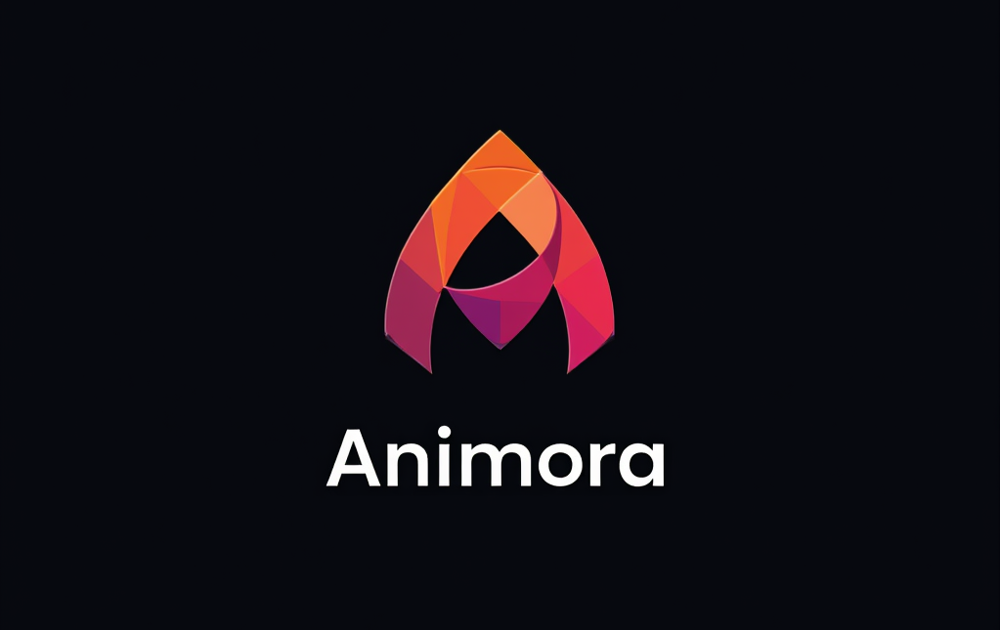

# Animora CSS Framework



Animora CSS is a modern, comprehensive CSS framework designed for building responsive, visually appealing, and animated web interfaces. It provides a robust set of utilities, components, and animations to streamline web development.

## Features

- 🎨 **Color System** – Extended palette with light/dark support
- 📏 **Spacing System** – From `2xs` to `3xl`
- 🧩 **Utility Classes** – Layout, Flexbox, Grid, Typography, Borders, Effects, Transforms, and more
- 🌈 **Themes** – Built-in dark mode with CSS variables
- 🎞 **Animations** – Dozens of built-in keyframes and animation helpers
- ⚙️ **Responsive Design** – Breakpoints (`sm`, `md`, `lg`) out-of-the-box
- 💠 **Components** – Cards, Buttons, Forms, Alerts, Badges, Utilities
- 💡 **Special Effects** – Glassmorphism, Typing Effects, Ripple, Morphing
- 🖨 **Print Support** – Optimized styles for print media

### Color System
- Extended color palette with primary, secondary, success, warning, danger, and info colors
- Complete grayscale range from black to white
- Light and dark variants for all main colors
- Gradient backgrounds support

### Layout System
- Flexible container system with max-width control
- Flexbox utilities with direction, wrap, and alignment options
- Responsive grid system with multiple column options
- Auto-fit and auto-fill grid layouts

### Spacing System
- Consistent spacing scale (2xs to 3xl)
- Margin and padding utilities with directional control
- Auto margin capabilities

### Typography
- Three font families: sans-serif, serif, and monospace
- Comprehensive font sizes from xs to 6xl
- Multiple font weights and line heights
- Text alignment and transformation utilities

### Animations
- Rich set of predefined animations (fade, slide, scale, pulse, bounce, etc.)
- Customizable duration, delay, and easing options
- Special effects like typing, glass, ripple, and morph
- Keyframe-based animation system

### Components
- Pre-styled cards with hover effects
- Buttons with multiple variants (primary, secondary, outline)
- Badges for notifications and status
- Alerts with contextual styling
- Form elements with focus states

### Responsive Design
- Breakpoints at 640px (sm), 768px (md), and 1024px (lg)
- Mobile-first approach
- Responsive utilities for layout, spacing, and typography

### Additional Features
- Dark mode support with color variable overrides
- Print styles for better document output
- Shadow and effect utilities
- Transition and transform controls
- Custom scrollbar styling

## Installation

1. Download `animora.min.css` from this repository
2. Include it in your HTML:

```html
<link rel="stylesheet" href="path/to/animora.min.css">
```

Or use it with a CDN:

```html
<link rel="stylesheet" href="https://github.com/makalin/animora.min.css">
```

## Usage

Basic example of a card component with animation:

```html
<div class="card anim-fade-in">
  <div class="card-header bg-primary text-white">
    <h3 class="m-0">Card Title</h3>
  </div>
  <div class="card-body">
    <p class="text-gray-700">Card content goes here</p>
    <button class="btn btn-primary">Click Me</button>
  </div>
</div>
```

Responsive grid layout:

```html
<div class="container grid gap-md sm:grid-cols-2 md:grid-cols-3 lg:grid-cols-4">
  <div class="card">Item 1</div>
  <div class="card">Item 2</div>
  <div class="card">Item 3</div>
  <div class="card">Item 4</div>
</div>
```

## Responsive Support

- `sm:` – 640px and up
- `md:` – 768px and up
- `lg:` – 1024px and up

```html
<div class="grid grid-cols-1 sm:grid-cols-2 md:grid-cols-3 lg:grid-cols-4">
```

## Dark Mode

Just add `.dark-mode` to `<html>` or `<body>` to activate:

```html
<body class="dark-mode">
  <div class="bg-gray-100 text-white p-md">Dark mode block</div>
</body>
```

## Components

- ✅ Cards: `.card`, `.card-header`, `.card-body`, `.card-footer`
- ✅ Buttons: `.btn`, `.btn-primary`, `.btn-secondary`, `.btn-outline`
- ✅ Alerts: `.alert-success`, `.alert-danger`, etc.
- ✅ Badges: `.badge`, `.badge-success`, etc.
- ✅ Forms: `.form-group`, `.form-label`, `.form-control`


## Available Animations

Classes like:

```html
<div class="anim-fade-in anim-once delay-300 ease-in">
```

Include:
- Fade, Slide (up/down/left/right), Scale, Pulse, Bounce, Float, Shake
- Morph, Jello, Heartbeat, Flip, Rotate, Spin
- Typing, Blink, Scroll Reveal, Ripple

## Print-Friendly

Includes media query styles for clean print layouts:
```html
<div class="no-print">Don't print this</div>
<div class="print-only">Only visible in print</div>
```

## Customization

Customize the framework by modifying the CSS variables in the `:root` selector:

```css
:root {
  --color-primary: #your-color;
  --space-md: 20px;
  --radius-md: 10px;
}
```

## Browser Support

- Latest Chrome
- Latest Firefox
- Latest Safari
- Latest Edge
- IE11+ (with some limitations)

## Contributing

1. Fork the repository
2. Create your feature branch (`git checkout -b feature/amazing-feature`)
3. Commit your changes (`git commit -m 'Add some amazing feature'`)
4. Push to the branch (`git push origin feature/amazing-feature`)
5. Open a Pull Request

## License

Distributed under the MIT License. See `LICENSE` file for more information.

## Acknowledgements

- Inspired by modern CSS frameworks like Tailwind CSS and Bootstrap
- Built with developer experience in mind
